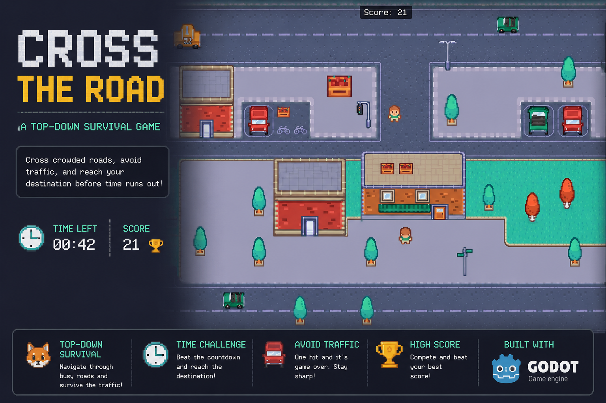

# Frogger



A 2D top-down survival game built with **Godot 4.6.2** using **GDScript**. Navigate across busy roads, dodge traffic, and reach the destination before time runs out.

---

## Overview

The player must cross multiple crowded roads within a time limit and reach the destination without getting hit by traffic. Each second survived adds to your score. One wrong move and it's back to the start.

---

## Gameplay

- Navigate across lanes of moving vehicles
- A score timer rewards longer survival
- Contact with any vehicle kills the player instantly
- Reach the finish zone to save your score and complete the run
- Goal: reach the destination zone in one piece

---

## Features

- **Smooth 4‑directional movement** — WASD or arrow keys
- **Dynamic car spawning** — cars appear at random from both edges of the road
- **Y‑sorted environment** — trees, benches, houses, and signs create depth
- **Animated player sprites** — directional walk animations with horizontal flipping
- **Zoomed pixel‑art camera** — 5× zoom with smooth position interpolation
- **Persistent score** — survives scene transitions via autoload singleton
- **Title & game‑over screen** — displays your final score
- **Full audio** — looping background music + positional car engine SFX
- **Borderless fullscreen** — 1920×1080 resolution

---

## Controls

| Action | Key        |
| ------ | ---------- |
| Move Up    | `W` / `↑`  |
| Move Down  | `S` / `↓`  |
| Move Left  | `A` / `←`  |
| Move Right | `D` / `→`  |
| Confirm / Start | `Space` |

---

## Tech Stack

| Layer | Choice |
|-------|--------|
| **Engine** | Godot 4.6.2 |
| **Language** | GDScript (explicit static types enforced) |
| **Rendering** | Forward Plus, 1920×1080 borderless fullscreen |
| **Physics** | 2D physics layers — Player, Walls, Cars, Water, Logs, Goal |
| **Asset Tracking** | Git LFS (binary assets via `.gitattributes`) |
| **Version Control** | Git + GitHub |

---

## Project Structure

```
├── assets/
│   ├── audio/          # Background music (OGG) + car engine (MP3)
│   ├── fonts/          # Better VCR, Crackman
│   └── graphics/
│       ├── cars/       # Green, red, yellow car sprites
│       ├── objects/    # Trees, benches, barriers, houses, signs, lights
│       ├── player/     # Player spritesheet (4‑direction tileset)
│       └── map.png     # Playfield background
├── scenes/
│   ├── Main.tscn       # Core gameplay scene
│   ├── Player.tscn     # Player character
│   ├── Car.tscn        # Enemy vehicle
│   ├── Title.tscn      # Title / game‑over screen
│   ├── Global.tscn     # Autoload singleton
│   └── (decoration scenes — Tree, Bench, Box, House, etc.)
├── scripts/
│   ├── main.gd         # Game flow, car spawning, scoring, scene transitions
│   ├── player.gd       # Movement, animation, input handling
│   ├── car.gd          # Car movement, off‑screen cleanup, random colours
│   ├── global.gd       # Global score variable
│   └── title.gd        # Title screen logic, score display
├── project.godot
├── .gitattributes
└── README.md
```

---

## Scenes Overview

| Scene | Type | Purpose |
|-------|------|---------|
| **Main** | `Node2D` | The game world — map, player, cars, obstacles, UI, finish zone |
| **Player** | `CharacterBody2D` | Frog character with animated sprite, camera, and collision |
| **Car** | `Area2D` | Moving obstacle with looping engine sound |
| **Title** | `Control` | Title screen — shows "Frogger" and final score, starts game on Space |
| **Global** | `Node` (autoload) | Persists score across scene changes, plays background music |

---

## Running the Game

1. **Clone the repository**
   ```bash
   git clone https://github.com/your-username/frogger.git
   cd frogger
   ```

2. **Install Git LFS** (required for binary assets)
   ```bash
   git lfs install
   git lfs pull
   ```

3. **Open in Godot 4.6.2**
   - Launch Godot 4.6.2
   - Click *Import* and select the `project.godot` file
   - Run the project (F5) — the main scene will start automatically

---

## Code Style

This project enforces **explicit static type annotations** in GDScript:

```gdscript
# Correct
var speed: float = 100.0
func move(delta: float) -> void:
    pass

# Wrong
var speed := 100.0
func move(delta):
    pass
```

---

## Acknowledgements

- **Music:** "City on Speed" by [S31](https://s31.bandcamp.com/)
- **Fonts:** Better VCR, Crackman
- **Sprites:** Original pixel art created for this project
- Built with [Godot Engine](https://godotengine.org/)
